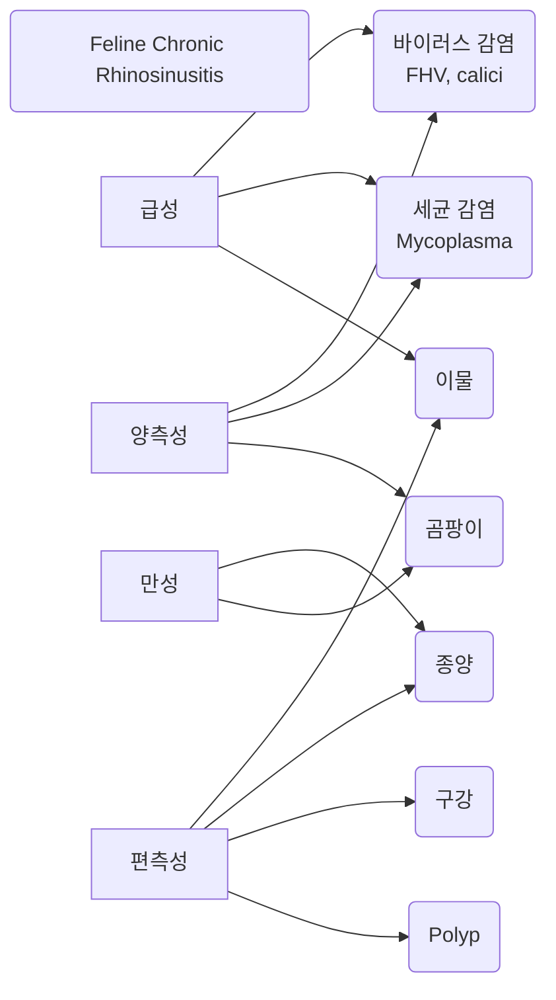

- 해부 Nasal cavity 구조

# Introduction

- 비강(nasal cavity), 부비동(paranasal sinus)에 질병이 생기면
	- nasal discharge (콧물)
	- congestion (코막힘)
	- sneezing (재채기)
	- stertor (호흡음-코골이)
	- 드물게 facial deformity (얼굴 변형)
	- 전신 증상 (**식욕 저하, 활력 저하**) - 식욕, 활력에 따라 치료 양상이 달라짐 (먹는 약? 입원? 2차적 질환?)
	- 더 드물게 신경 증상

# 임상적 진단

## Nasal discharge (콧물)

- 정상적으로 맑은 콧물 가능
- 폐렴, 전신 질환의 가능성
- **serous** (맑은 콧물) : 정상 / **바이러스 감염**, 농성의 초기 단계
- **mucopurulent** (농성 콧물) : **염증성** 질환^[염증에 의해 정상적인 호흡기 상피와 섬모가 파괴되면 bacteria - neutrophil이 증가함. 퇴행성 호중구 ⇒ 농]

>[!check] 농성 콧물에서 가능한 경우
>- 바이러스 감염 : Feline **herpesvirus**, Feline **calicivirus**, Canine influenza virus
>- 세균 감염 : **Mycoplasma** felis (w. 허피스)
>- 이물질
>- 비강 종양 : 피가 날 때
>- 구강 질환 : 주로 이빨 문제
>- nasopharyngeal polyp : 고양이 인두에서 양성 종괴
>- 알러지성 비영
>- 기생충, 곰팡이 : 한국에서 드문 케이스
>- 이유 없이 계속 → feline chronic rhinosinusitis

>[!check] 혈액성 콧물(코피)에서 가능한 경우
>- trauma (외상)
>- **neoplasia** (종양) : 나이 좀 있고 코피부터 나면 대부분 종양
>- **mycotic** infection
>- 전신 출혈, 고혈압 : 혈변, 혈구토 등이 먼저 나옴

#### History taking

- **Acute** → 이물질, 바이러스
  **Chronic** → 종양, 곰팡이 감염
- gagging, retching, reverse sneezing → caudal nasopharynx 문제, 이물 (진단 유의)

#### 신체 검사

- 차가운 슬라이드를 대서 입김에 한쪽에 서리는지, 양쪽에 서리는지 확인
	- 양측성 → 전신 질환, 감염성 질환
	- 편측성 → 이물, 양성 종괴(polyp), 종양, 이빨 문제
- 얼굴 대칭성, 이빨/잇몸 이상, 연구개/경구개 이상, mandibular lymph node 확인, 눈 확인, 종괴 여부 및 얼굴 변성 확인
- 만졌을 때 아파하고, 코판의 궤양(ulceration)이 있으며, 콧구멍 색이 빠지면 → aspergillosis (곰팡이 감염)
콧물

A 바이러스 감염 (맑은 콧물, 농성 콧물, 급성, 양측성)

B 세균 감염 (농성 콧물, 양측성

C 이물 (gagging, retching, reverse sneezing, 급성, 농성, 편측성

D 종양 (코피+농성, 만성, 편측성)

E 곰팡이 (코피, 만성, 양측성 spergillosis-아파함, 궤양, 콧구멍 색 빠짐)

F 구강 질환 (농성 콧물, 이빨 문제-편측성, dental X-ray 추천

G polyp (편측성, 농성, 얼굴 변성

H feline chronic rhinosinusitis (이유 없이 농성 콧물 지속)

%%

%%

## Sneezing

## Reverse Sneezing

## Facial deformity