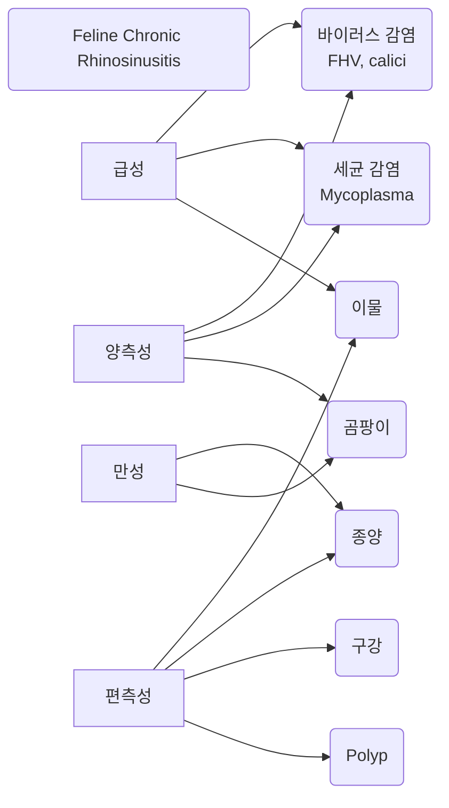

- 해부 Nasal cavity 구조

# Introduction

- 비강(nasal cavity), 부비동(paranasal sinus)에 질병이 생기면

|                       |           대표 증상           |                               |
| :-------------------: | :-----------------------: | :---------------------------: |
| Nasal discharge 콧물 |     Congestion 코막힘     |        Sneezing 재채기        |
| Stertor 호흡음 (코골이)  | Facial deformity 얼굴 변형 | 전신 증상 (식욕 저하, 활력 저하) 신경 증상 |
> **"식욕이랑 활력은 괜찮나요?"** : 보호자에게 반드시 하게 되는 질문.
> - 식욕/활력이 괜찮으면 약을 쓰기 수월하고,
> - 식욕/활력이 떨어지면 약을 잘 못 먹어 입원 치료 필요, 탈수로 인한 2차 질환 가능성.

# 임상적 진단

## Nasal discharge (콧물)

- 정상적으로 맑은 콧물 가능
- 폐렴, 전신 질환의 가능성

| 콧물                |                                                                     |
| ----------------- | ------------------------------------------------------------------- |
| serous (맑은)       | 정상 or 바이러스 감염, 농성 초기 단게                                             |
| mucopurulent (농성) | 염증성 질환 바이러스 감염 (herpes, calici, influenza) 세균 감염 (mycoplasma) |

- 염증에 의해 정상적인 호흡기 상피와 섬모가 파괴되면 bacteria - neutrophil이 증가함. 퇴행성 호중구 ⇒ 농 형성

>[!check] 농성 콧물에서 가능한 경우
>- 바이러스 감염 : Feline **herpesvirus**, Feline **calicivirus**, Canine influenza virus
>- 세균 감염 : **Mycoplasma** felis (w. 허피스)
>- 이물질
>- 비강 종양 : 피가 날 때
>- 구강 질환 : 주로 이빨 문제
>- nasopharyngeal polyp : 고양이 인두에서 양성 종괴
>- 알러지성 비영
>- 기생충, 곰팡이 : 한국에서 드문 케이스
>- 이유 없이 계속 → <u>feline chronic rhinosinusitis</u>

>[!check] 혈액성 콧물(코피)에서 가능한 경우
>- trauma (외상)
>- **neoplasia** (종양) : <u>나이 좀 있고 코피부터 나면 대부분 종양</u>
>- **mycotic** infection
>- 전신 출혈, 고혈압 : 혈변, 혈구토 등이 코피보다 먼저 발생

#### History taking

| 문진                                     |                                |
| -------------------------------------- | ------------------------------ |
| Acute                                  | 이물질, 바이러스                      |
| Chronic                                | 종양, 곰팡이 감염                     |
| gagging, retching, reverse sneezing | caudal nasopharynx의 문제         |
| 이물 가능성                                 | 진단 어려움. (특히 Plant material) |

#### 신체 검사

| 신체 검사            |                                                                                |
| ---------------- | ------------------------------------------------------------------------------ |
| **콧물**           | (차가운 슬라이드를 대서 입김에 한쪽or양쪽에 서리는지 확인)                                             |
| 양측성              | 전신 질환, 감염성 질환                                                                  |
| 편측성              | 편측에 낀 이물, 양성 종괴(polyp), 종양, 이빨 문제                                              |
| **머리**           |                                                                                |
| 이상 확인            | facial symmetry, teeth, gingiva(잇몸), hard&soft palate, mandibular LN, eye 등 |
| 얼굴 변성            | 종괴(mass) → 경구개 변성, 눈알이 튀어나오거나 들어감 종양, 곰팡이성(cryptococcosis), 치아 질환           |
| Aspergillosis    | pain, nasal plane의 궤양, 콧구멍 색빠짐, 뼈 녹음                                           |
| **이빨**           |                                                                                |
| Mandibular LN 비대 | 염증, 종양, *Cryptococcus* ([[FNA|FNA]]로 확인)                                           |
| 이빨 깨짐            | 치수강으로 세균 들어가 alveolar bone을 녹일 수 있음. 정상으로 보여도 dental X-ray 필요할 수 있음.        |

### + Nasopharyngeal disease

%%
콧물

A 바이러스 감염 (맑은 콧물, 농성 콧물, 급성, 양측성)

B 세균 감염 (농성 콧물, 양측성

C 이물 (gagging, retching, reverse sneezing, 급성, 농성, 편측성

D 종양 (코피+농성, 만성, 편측성)

E 곰팡이 (코피, 만성, 양측성 spergillosis-아파함, 궤양, 콧구멍 색 빠짐)

F 구강 질환 (농성 콧물, 이빨 문제-편측성, dental X-ray 추천

G polyp (편측성, 농성, 얼굴 변성

H feline chronic rhinosinusitis (이유 없이 농성 콧물 지속)

%%

## Sneezing

## Reverse Sneezing

## Facial deformity