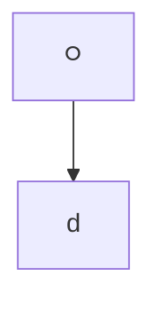
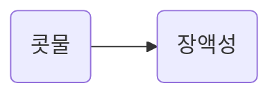
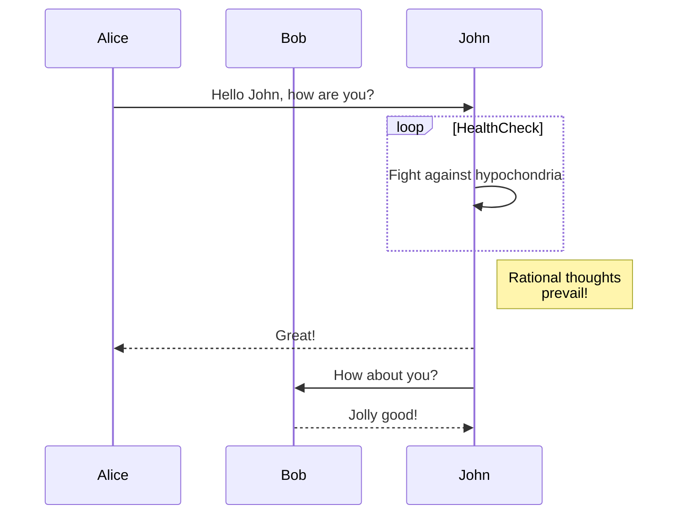
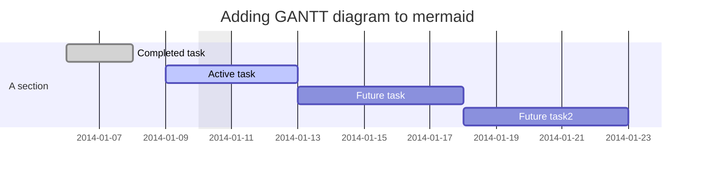
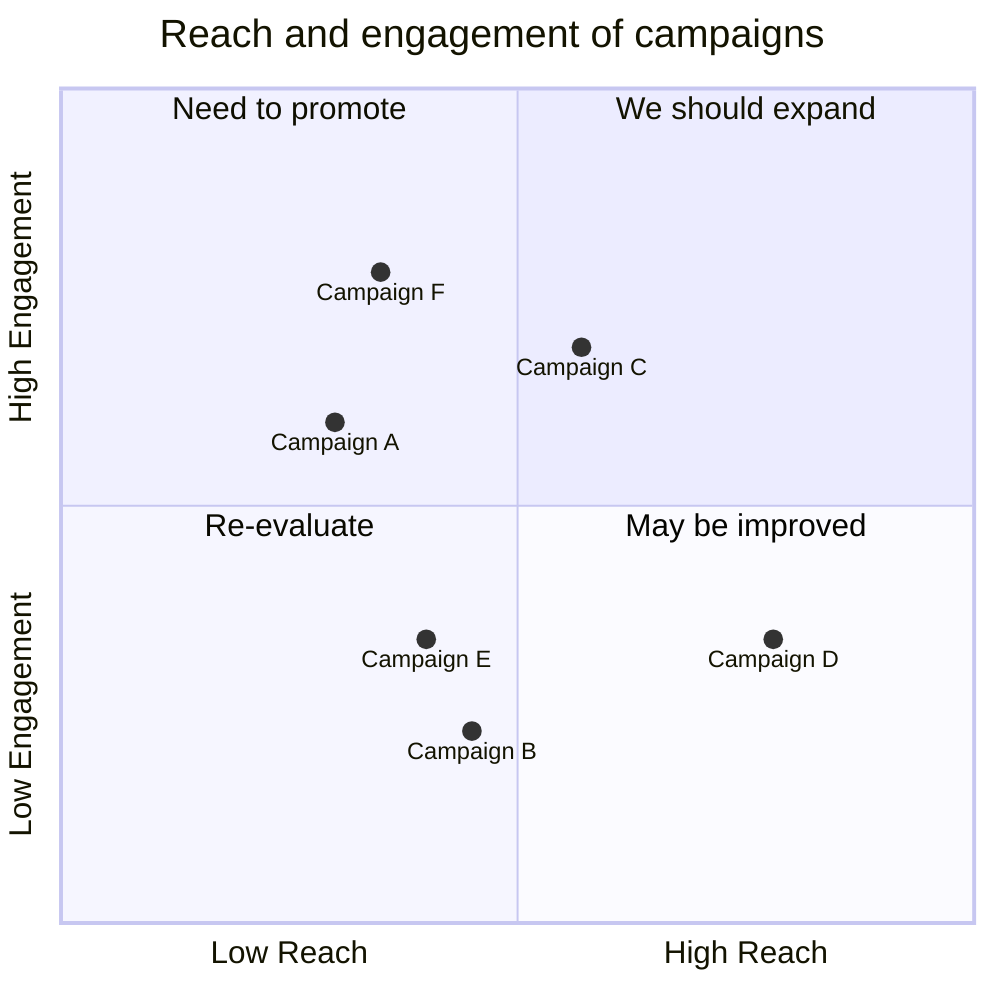
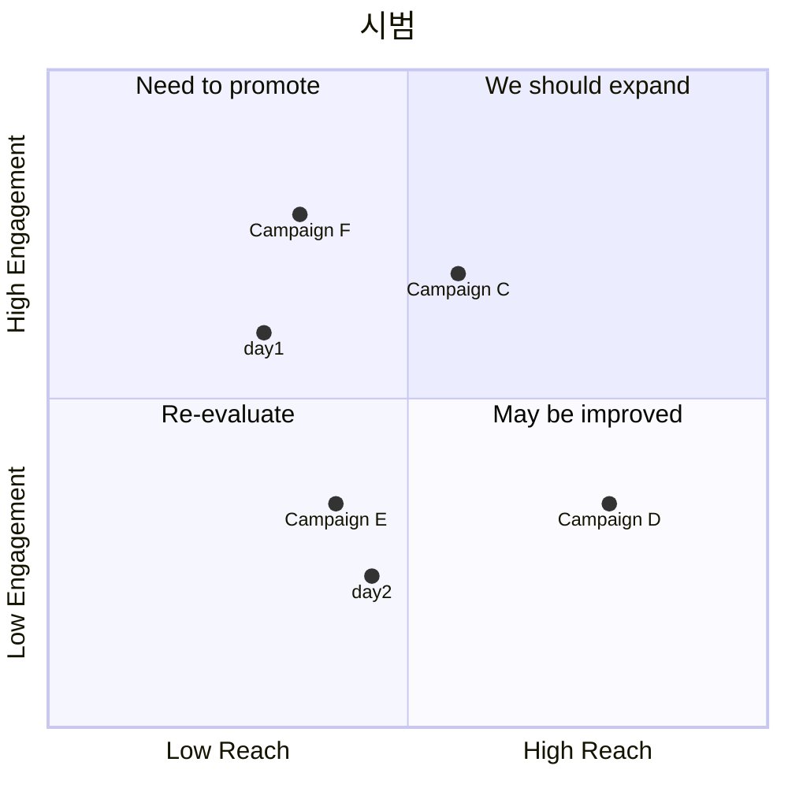

https://publish.obsidian.md/andrea9292/2+Area/%EC%83%9D%EC%82%B0%EC%84%B1+%EB%8F%84%EA%B5%AC/Obsidian+%EC%9D%B4%EC%95%BC%EA%B8%B0/%EA%B7%B8%EB%A6%AC%EB%A9%B4%EC%84%9C+%EB%94%B0%EB%9D%BC%ED%95%98%EB%8A%94+Mermaid+%EC%97%B0%EC%8A%B5

https://mermaid.js.org/intro/

https://mermaid.live/

