https://publish.obsidian.md/andrea9292/2+Area/%EC%83%9D%EC%82%B0%EC%84%B1+%EB%8F%84%EA%B5%AC/Obsidian+%EC%9D%B4%EC%95%BC%EA%B8%B0/%EA%B7%B8%EB%A6%AC%EB%A9%B4%EC%84%9C+%EB%94%B0%EB%9D%BC%ED%95%98%EB%8A%94+Mermaid+%EC%97%B0%EC%8A%B5

https://mermaid.js.org/intro/

https://mermaid.live/

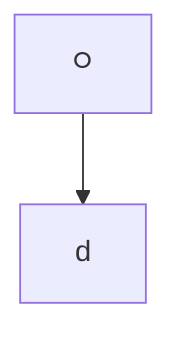
```mermaid
graph TD;
	A["ㅇ"] --> B["d"]
```

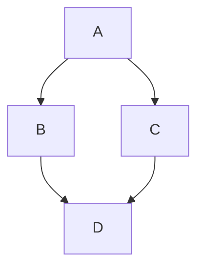
```mermaid
graph TD;
    A-->B;
    A-->C;
    B-->D;
    C-->D;
```

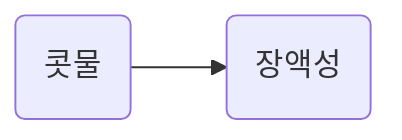
```mermaid
graph LR;
A("콧물") --> B("장액성")
```
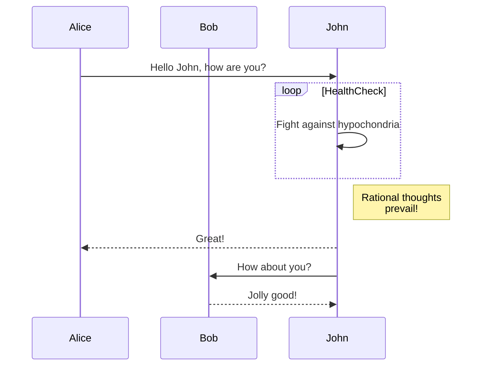
```mermaid
sequenceDiagram
    participant Alice
    participant Bob
    Alice->>John: Hello John, how are you?
    loop HealthCheck
        John->>John: Fight against hypochondria
    end
    Note right of John: Rational thoughts <br/>prevail!
    John-->>Alice: Great!
    John->>Bob: How about you?
    Bob-->>John: Jolly good!
```

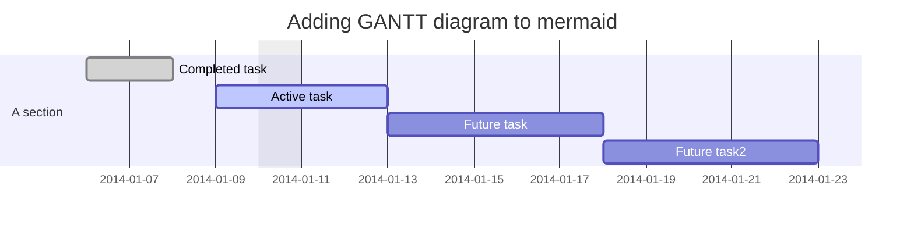
```mermaid
gantt
dateFormat  YYYY-MM-DD
title Adding GANTT diagram to mermaid
excludes weekdays 2014-01-10

section A section
Completed task            :done,    des1, 2014-01-06,2014-01-08
Active task               :active,  des2, 2014-01-09, 3d
Future task               :         des3, after des2, 5d
Future task2               :         des4, after des3, 5d
```

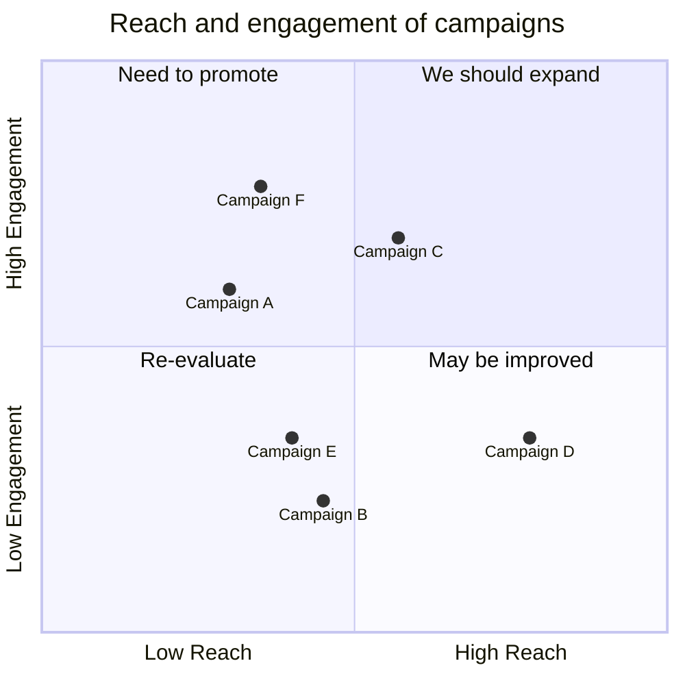
```mermaid
quadrantChart
    title Reach and engagement of campaigns
    x-axis Low Reach --> High Reach
    y-axis Low Engagement --> High Engagement
    quadrant-1 We should expand
    quadrant-2 Need to promote
    quadrant-3 Re-evaluate
    quadrant-4 May be improved
    Campaign A: [0.3, 0.6]
    Campaign B: [0.45, 0.23]
    Campaign C: [0.57, 0.69]
    Campaign D: [0.78, 0.34]
    Campaign E: [0.40, 0.34]
    Campaign F: [0.35, 0.78]
```

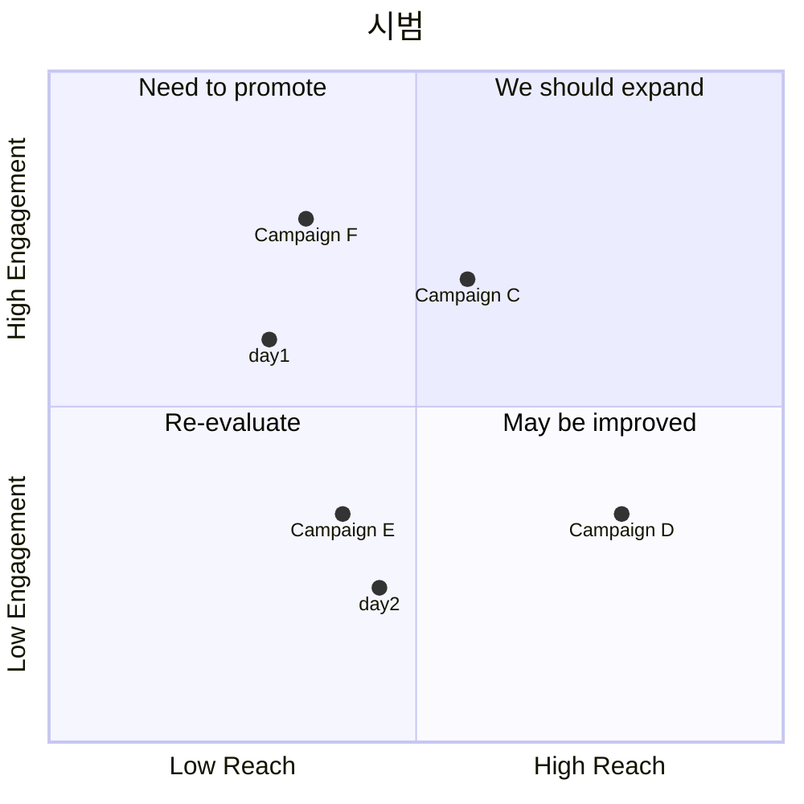
```mermaid
quadrantChart
    title 시범
    x-axis Low Reach --> High Reach
    y-axis Low Engagement --> High Engagement
    quadrant-1 We should expand
    quadrant-2 Need to promote
    quadrant-3 Re-evaluate
    quadrant-4 May be improved
    day1: [0.3, 0.6]
    day2: [0.45, 0.23]
    Campaign C: [0.57, 0.69]
    Campaign D: [0.78, 0.34]
    Campaign E: [0.40, 0.34]
    Campaign F: [0.35, 0.78]
```

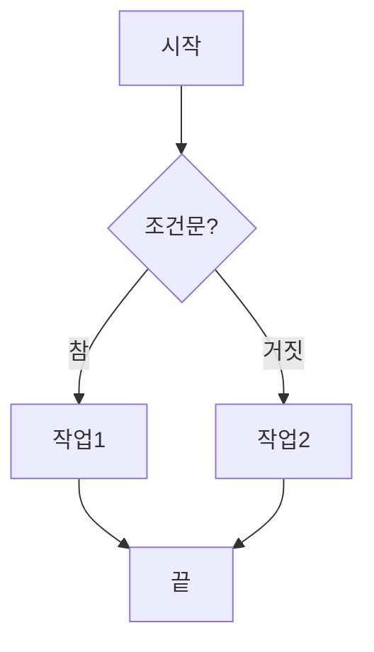
```mermaid
graph TD;
    A[시작] --> B{조건문?};
    B -->|참| C[작업1];
    B -->|거짓| D[작업2];
    C --> E[끝];
    D --> E;
```

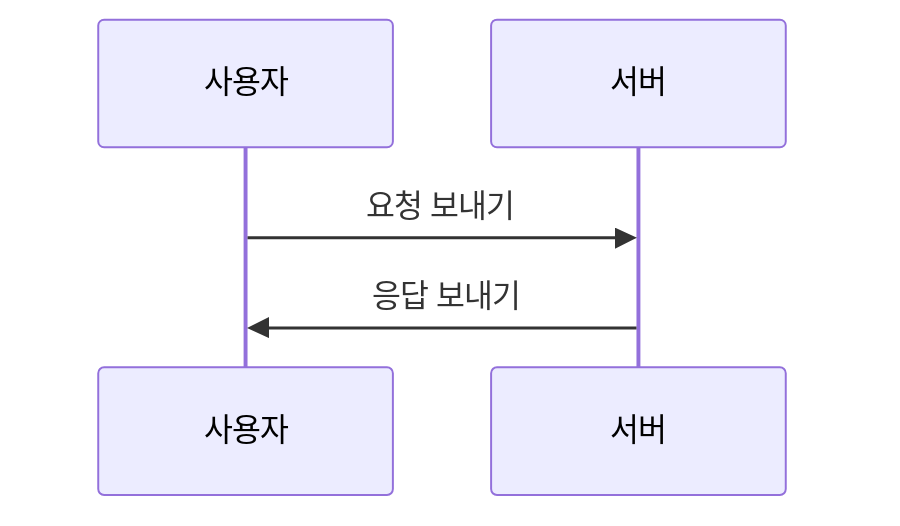
```mermaid
sequenceDiagram
    participant A as 사용자
    participant B as 서버
    A->>B: 요청 보내기
    B->>A: 응답 보내기
```

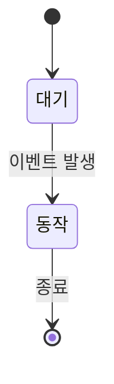
```mermaid
stateDiagram
    [*] --> 대기
    대기 --> 동작 : 이벤트 발생
    동작 --> [*] : 종료
```

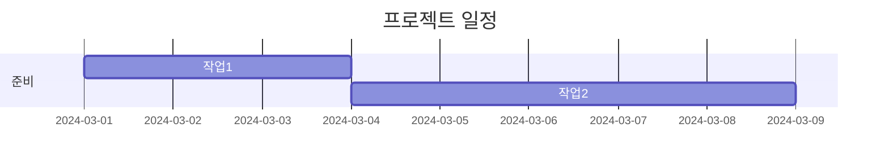
```mermaid
gantt
    title 프로젝트 일정
    section 준비
    작업1 :a1, 2024-03-01, 3d
    작업2 :a2, after a1, 5d
```

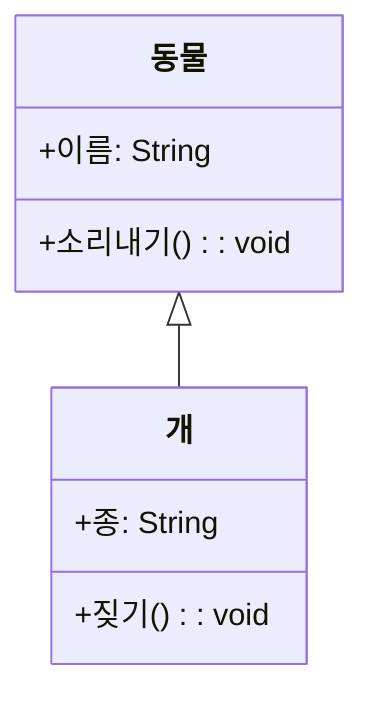
```mermaid
classDiagram
    class 동물 {
        +이름: String
        +소리내기(): void
    }
    class 개 {
        +종: String
        +짖기(): void
    }
    동물 <|-- 개
```

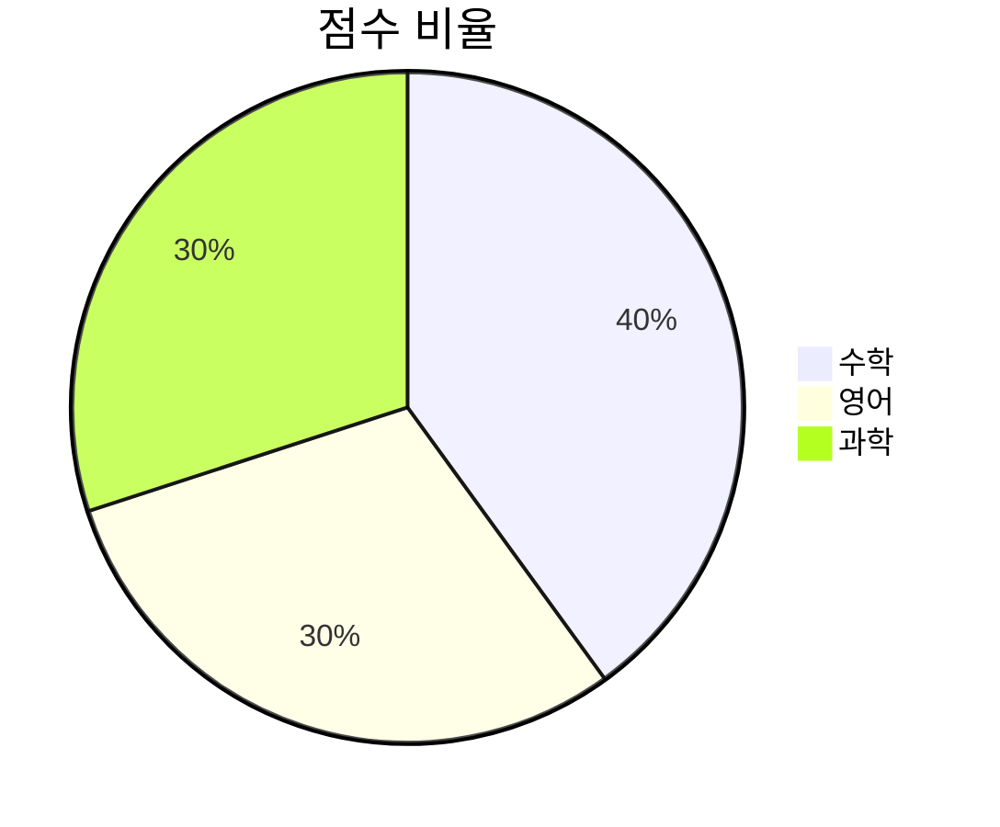
```mermaid
pie
    title 점수 비율
    "수학" : 40
    "영어" : 30
    "과학" : 30
```

| 다이어그램 종류  | 키워드             |
|-----------|-----------------|
| 흐름도       | graph           |
| 순서도       | sequenceDiagram |
| 상태도       | stateDiagram    |
| 간트 차트     | gantt           |
| 클래스 다이어그램 | classDiagram    |
| 파이 차트     | pie             |

---

**📌 이 코드의 핵심 포인트:**  
✅ `classDef smallGraph font-size:12px;` → **폰트 크기를 줄이면 다이어그램도 작아짐!**  
✅ `class A,B,C,D,E smallGraph;` → **모든 노드에 적용**

🎯 **결과적으로 다이어그램 크기가 줄어듦!**

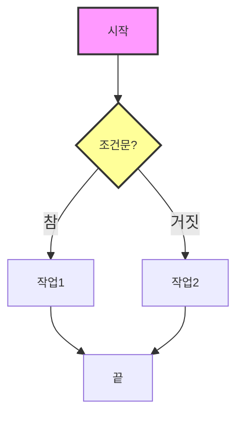
```mermaid
graph TD;
    A[시작] --> B{조건문?};
    B -->|참| C[작업1];
    B -->|거짓| D[작업2];
    C --> E[끝];
    D --> E;

    style A fill:#f9f,stroke:#333,stroke-width:2px;
    style B fill:#ff9,stroke:#333,stroke-width:2px;

    classDef smallGraph font-size:12px;
    class A,B,C,D,E smallGraph;
```

